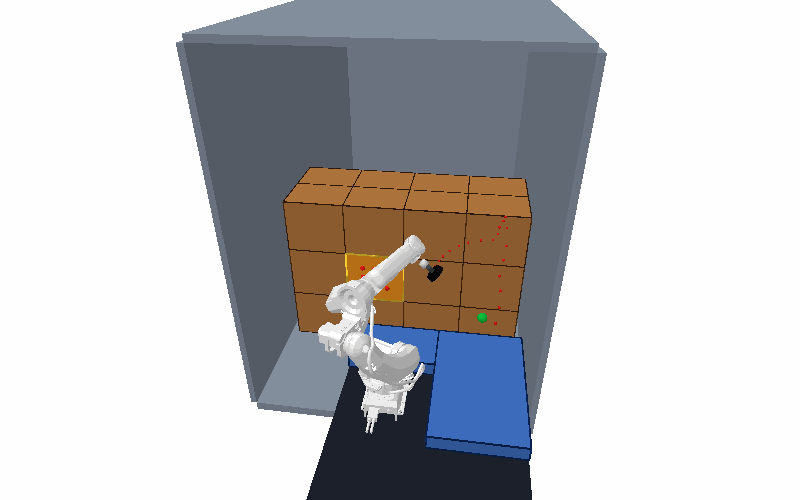

# Trailer Unloading Geometric Simulator v0.3

面向厢式货车卸垛的六轴工业机器人第一层几何仿真与工程评估工具。工程以 FANUC M-20iD/35 为主要验证机型，同时保留 KUKA KR 50 R2500 适配；核心算法只依赖 CPU，不要求 ROS 2、Isaac Sim 或 GPU。

v0.3 的定位是“确定、可测试、可审计的数字样机”，用于方案筛选、算法回归和风险暴露，不代表真机安全认证或厂商负载认证已经通过。



## 这个工程解决什么问题

工程把一次机器人卸箱任务拆成可独立验证的几层：

```text
车厢、纸箱、机器人、吸具配置
  -> 抓取面与吸盘覆盖候选
  -> 多起点 IK 与碰撞检查
  -> 脱垛、搬运、放置路径规划
  -> 轨迹复核、时间参数化与缓存
  -> 负载 / 可达性 / 周期评估
  -> PyBullet 或 Isaac Sim 可选回放与审计证据
```

主要能力包括：

- 使用 OBB、胶囊体和 URDF 网格描述车厢、纸箱、输送带、机器人与吸具；
- 检查机器人自碰撞、机器人—环境、所抓箱体—机器人、箱体—车厢/其他箱体碰撞；
- 生成正面、侧面、顶面吸取候选，并检查吸盘覆盖和抓取法向；
- 使用确定性多起点 IK、双向 RRT-Connect、笛卡尔脱垛段和碰撞复核捷径规划完整抓放动作；
- 根据箱体支撑/遮挡关系决定可移除顺序，并协调固定底座或 AMR 停靠位与 L 形输送带；
- 对轨迹做速度、加速度、jerk 时间参数化和缓存重验证；
- 生成批量可达性/碰撞筛查、机器人底座覆盖优化和卸箱周期统计；
- 通过 PyBullet 做轻量动力学/传感器回放，通过独立适配器导出 Isaac Sim 验收任务。

世界坐标固定为：`+X` 指向车厢内部，`+Y` 向左，`+Z` 向上。配置和计算统一使用 SI 单位：米、弧度、秒、千克。

## v0.3 新增与调整

- 新增 `unloading_sim.robot_load`：使用 URDF/FK 给出的 J4–J6 实际轴线，计算工具和纸箱的空间惯量、重力矩与轴向惯量参考值；旧的“法兰 XYZ 等同腕部轴”模型只保留为可复现的历史接口。
- 新增负载感知任务姿态筛选：确定性搜索腕部滚转、表面法向和 IK 种子，保留最佳/次佳姿态及逐轴失败原因。
- 新增 FANUC 厂商证据适配层。公开资料缺少可追溯的完整负载—质心图时，结果保持 `NOT_EVALUATED`，不会把工程参考值内的姿态升级为厂商认证通过。
- 新增确定性 Monte Carlo 周期模型，使用共同随机数比较不同 NORMAL 周期，并计算目标吞吐量所需的正常周期上限。
- 新增轻量批量筛查与一键资格评估套件；完整 PyBullet 横截面研究同步接入统一腕部限制配置。
- 横向输送带与机器人基座/J2 保护包络的净空由 275 mm 修正为 300 mm，同时保留距最近纸箱 200 mm 的门槛。
- 清除历史渲染、调试报告、搜索配置和一次性迁移脚本；生成结果统一写入被 Git 忽略的 `outputs/` 或 `results/`。
- 补全 KUKA KR 50 R2500 子模块声明，新的递归克隆可直接还原依赖资源。

详细发布说明见 [`docs/releases/V0.3.md`](docs/releases/V0.3.md)。

## 安装

需要 Python 3.10 或更高版本。

```bash
git clone --recurse-submodules https://github.com/QGG716/pick-and-place-simulation.git
cd pick-and-place-simulation
python -m venv .venv
```

激活虚拟环境：

```bash
# Linux / macOS
source .venv/bin/activate

# Windows PowerShell
.venv\Scripts\Activate.ps1
```

安装核心与测试依赖：

```bash
python -m pip install -e ".[dev]"
```

需要 PyBullet 回放时：

```bash
python -m pip install -e ".[dev,viz]"
```

如果已经克隆但子模块为空，可执行：

```bash
git submodule update --init --recursive
```

## 快速开始

### 1. 运行五秒内的核心演示

```bash
python -m unloading_sim.demo --config config/demo.yaml
```

输出写入 `outputs/demo/`，包含轨迹、指标和规划图；该目录不会提交到 Git。

### 2. 运行 v0.3 工程资格评估

```bash
python tools/run_qualification_suite.py
```

该命令把三类结果写入一个带时间戳的 `results/<timestamp>/` 目录：

- 负载、腕部力矩和惯量工程包络；
- 车厢横截面的轻量 fail-closed 排除筛查；
- 目标 900 箱/小时的周期 Monte Carlo 模型。

产物包括 CSV、PNG、摘要 JSON、输入哈希、命令记录和技术报告。默认结论可能是 `NOT_QUALIFIED` 或 `NOT_EVALUATED`；这是缺少证据或已知约束失败的真实表达，不应手工改成通过。

也可以分别运行：

```bash
python tools/analyze_payload_envelope.py \
  --robot fanuc_m20id_35 \
  --tool configs/tools/unloading_gripper.yaml

python tools/run_reachability_study.py \
  --robot fanuc_m20id_35 \
  --truck configs/trucks/2p3x2p7.yaml \
  --payloads 5 15 25

python tools/run_cycle_simulation.py \
  --config configs/cycle/unloading_900pph.yaml
```

轻量可达性命令只证明“可排除”，不证明“任务可达”：未执行的姿态 IK、关节/奇异性裕量、扫掠碰撞、脱垛、退避和轨迹动力学检查都保留为 `NOT_EVALUATED`。

### 3. 运行完整横截面研究

完整研究使用真实 URDF、工具碰撞体、纸箱邻域和离散扫掠路径检查。安装 PyBullet 后运行：

```bash
python studies/fanuc_m20id35_cross_section/run_study.py \
  --config studies/fanuc_m20id35_cross_section/study_config.json \
  --backend pybullet \
  --workers 8 \
  --audit-best
```

`--workers` 可按本机逻辑 CPU 数调整。该研究是确定性的密集离散路径采样，不是解析连续碰撞证明；采样步长和安全余量会写入输出参数。

### 4. 生成 FANUC 卸垛方案

```bash
python -m unloading_sim.online_unload \
  --config config/fanuc_m20id35.yaml \
  --max-picks 8 \
  --top-layer-only \
  --output-dir outputs/fanuc_m20id35/top_layer
```

冷启动 IK/RRT 用于离线生成和回归，不应直接作为生产在线主链路。生产方向是：场景签名/热图查表、最近 IK 分支、整条缓存轨迹碰撞复核，只对失效局部做限时修补。

### 5. 可选回放后端

PyBullet 使用示例：

```bash
python -m unloading_sim.pybullet_online_kuka \
  --plan outputs/fanuc_m20id35/top_layer/online_plan.json \
  --direct \
  --gif outputs/fanuc_m20id35/top_layer.gif
```

Isaac Sim 不进入核心依赖。服务器安装、USD 导出、回放和证据文件说明见 [`docs/isaacsim_server.md`](docs/isaacsim_server.md)，后端边界与验收策略见 [`docs/digital_twin_backend.md`](docs/digital_twin_backend.md)。

## 目录结构

```text
src/unloading_sim/            核心 Python 包
  geometry.py                 OBB、胶囊体、SO(3) 工具
  robot.py                    DH/URDF 机器人、FK、Jacobian、碰撞体
  scene.py                    场景模型与递归 YAML 配置
  ik.py                       阻尼最小二乘多起点 IK
  planner.py                  RRT-Connect、捷径和平滑
  grasp.py                    抓取/放置候选与完整抓放规划
  support.py                  支撑/遮挡关系和移除顺序
  reachability.py             批量可达性与碰撞热图
  base_optimization.py        底座位姿覆盖优化
  timing.py / trajectory.py   时间参数化、审计与拐角融合
  robot_load/                 v0.3 负载、空间惯量与任务姿态评估
  cycle.py                    v0.3 周期 Monte Carlo 模型

config/                       运行时场景、规划与回放配置
configs/                      资格评估输入、工具/机器人/厂商证据配置
tools/                        可复现的资格评估命令
studies/                      较重、较慢的专项研究
scripts/                      PyBullet/Isaac Sim 适配与资源分析脚本
assets/                       机器人、吸具、材质及来源说明
third_party/                  外部机器人资源子模块
tests/                        单元与回归测试
docs/                         架构、后端和发布文档
```

`geometry.py`、`robot.py`、`scene.py`、`ik.py`、`planner.py` 和 `grasp.py` 保持可独立测试；重型后端只能通过适配器和可选依赖接入。所有新增规划或评估入口必须提供确定性随机种子。

## 测试

```bash
pytest -q
```

测试覆盖几何原语、FK/IK、碰撞、抓放规划、支撑关系、底座优化、轨迹约束、PyBullet/Pinocchio 可选后端、数字样机接口，以及 v0.3 的负载和周期模型。

## 证据语义与当前边界

以下概念必须区分：

- `PASS`：该项检查在已声明的模型和输入下通过；
- `NOT_EVALUATED`：缺少数据或本次流程没有执行该检查；
- `NOT_QUALIFIED`：当前证据不足以给出完整工程/厂商资格结论；
- `FAIL_*`：已知硬约束失败。

当前仍未完整模拟或标定：

- 纸箱柔性、破损、挤压和连锁坍塌；
- 真空流量、密封、漏气、剥离力矩和脱落；
- 真实控制器插补、完整关节动力学、柔顺控制与力控；
- 视觉噪声、遮挡误差和长期标定漂移；
- FANUC 完整负载—质心图、ROBOGUIDE 验证或等价厂商证据；
- 安全 PLC、工业现场节拍和真机认证。

进入真机前，必须使用厂商精确碰撞模型、真实工具质量/质心/惯量、负载图、控制器日志和吸具试验重新验证全部轨迹。Isaac Sim 或 PyBullet 的通过结果都不能替代工业安全评估。

## 资源与版本

- FANUC M-20iD/35 资源来源和许可证见 [`assets/robots/fanuc_m20id35/SOURCE.md`](assets/robots/fanuc_m20id35/SOURCE.md) 与同目录 `LICENSE.txt`。
- KUKA KR 50 R2500 来自声明在 `.gitmodules` 中的第三方仓库。
- 当前版本：`v0.3`；Python 包版本：`0.3.0`；发布分支：`release/v0.3`。
