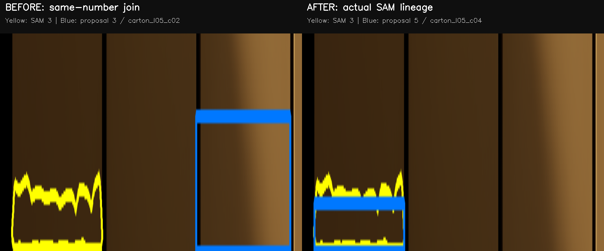
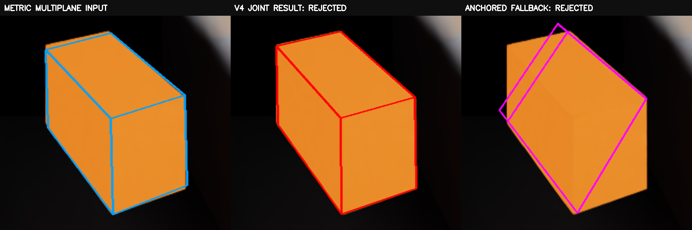
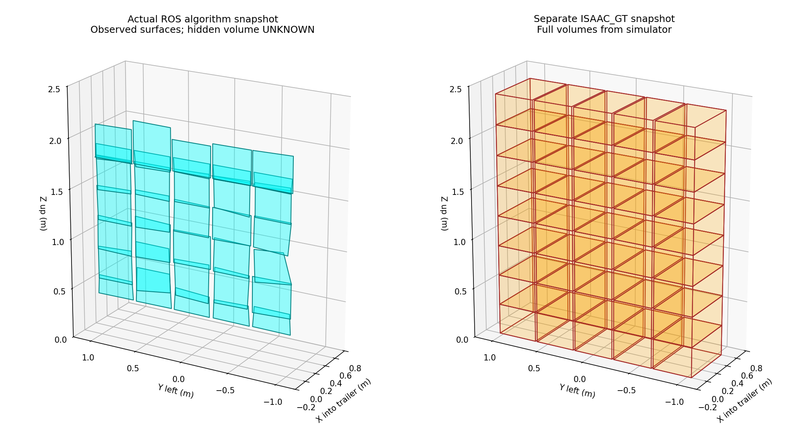
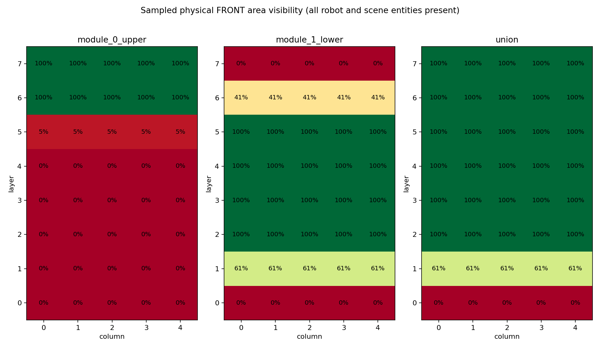

# 双 RGB-D 修正验收（2026-09-14）

本轮完成了身份连接修复、最终度量检查、局部面关联、算法 ROS 交接、Humble CI 修复和 MoGe 解耦。**没有整体几何 PASS：标定箱仍失败，8 次 V4 联合拟合全部被独立检查拒绝；面片实体边界和跨视角歧义仍存在。** 所有计算、测试、推理、渲染和图表生成在指定服务器完成；GitHub CI 使用独立 Ubuntu 22.04/Humble 容器。未执行规划器或真实机器人操作。

证据目录：[corrected-dual-rgbd-20260914](evidence/corrected-dual-rgbd-20260914/)。



## 逐项回答

**1. 起始、结束与被测 SHA**

起始本地、origin 和专用服务器工作副本均为 `bd00dfe365af0bffefeb9c021c43ed052f9a4534`，工作树干净。最终功能代码为 `0507a69841174346ed92d293c80fcd9f0ea4ee79`；CPU、Humble、正式双模组/缺模组 ROS 验收使用该提交。几何冻结重算与身份最终重评估使用 `6f6e2b34dd9cbf2dee7ea567e5ebf2b05018b4c5`；随后 `0507a69` 只增加世界快照来源/缺模组语义及 ROS 负例探针，不改变几何算法。

上游始终固定为 `1d208f2ed380a207e6e46b4a62d2ac640edfe477`，未修改其工作树。只读机械接口参考为 `648e177a03d2a5a5d8a2f11e9141c57763325805`。证据归档提交在功能代码之后；最终回复另列归档后的实际三端 HEAD 和最新 CI，避免把功能测试 SHA 与文档提交混为一谈。

**2. 是否复现实例错配，影响哪些对象？**

已复现。满垛上模组 13 个 SAM 实例中，11 个重编号后不再等于原 proposal ID。真实连接为：

| SAM ID | 真实 proposal ID | supporting proposals |
|---|---|---|
| 1, 2 | 1, 2 | 无 |
| 3, 4, 5 | 5, 6, 7 | 无 |
| 6 | 8 | 3 |
| 7 | 9 | 4 |
| 8, 9, 10, 11, 12, 13 | 10, 11, 12, 13, 14, 15 | 无 |

SAM 6、7 各含跨实体 NMS 合并线索，标记为 `AMBIGUOUS_MERGED_ENTITIES`，没有复制 mask、强行恢复 proposal 数量或选最近 GT。下模组 31 个数字连接未变化。旧 bbox、实体对应、mask IoU、中心/姿态/尺寸评价因此受影响。

新解析按真实 JSON、NPZ `mask_ids`、proposal audit 连接，并校验数组长度、重复键、bbox、分数、面积、来源路径和命名空间。读取缓存前核对输入 RGB、proposal、metrics、输出文件 hash，以及 SAM revision/固定上游。生产 `object_id/track_id` 不使用 GT 或帧内编号；SAM 回归分数原样保留，oracle 的 1.0 不充当检测置信度。

逐实例证据：[JSON](evidence/corrected-dual-rgbd-20260914/identity/instance_lineage_audit.json)、[CSV](evidence/corrected-dual-rgbd-20260914/identity/identity_mapping_before_after.csv)。

**3. 修正映射后实际误差是多少？**

以下是**只修身份、保留旧几何**的第一关结果；未重跑 SAM、MoGe 或几何。两份身份冲突的合并 mask 不进入唯一实体 GT 均值，因此上模组前后均值的样本集合不同，不能当成算法精度提升。

| 指标 | 上模组旧评价 | 上模组正确身份评价 | 下模组正确身份评价 |
|---|---:|---:|---:|
| mask IoU 均值 | 0.051484 | 0.793143 | 0.824951（不变） |
| 完整体中心误差均值 | 1.026371 m | 0.097709 m | 无可评完整体 |
| D2 等价姿态误差 | 见原 JSON | 0.435312° | 无可评完整体 |
| XYZ 完整尺寸绝对误差 | 见原 JSON | 0.184711 / 0.012665 / 0.014753 m | 无可评完整体 |

上模组 13 个预测中 11 个可唯一匹配；中心、姿态和尺寸均值只覆盖其中 5 个有旧完整体假设的样本。下模组 31 个。0.097709 m 仍是旧完整体假设的真实误差，不代表最终获得认证体积。[前后完整评价](evidence/corrected-dual-rgbd-20260914/identity/identity_corrected_evaluation.json)。早期工作中展示的第一关输出另保存在 [初次审计目录](evidence/identity-corrected-20260914/)；其 `code_sha=bd00dfe` 是当时未提交修复工作树的基点，最终可复现版本以本目录的 `6f6e2b3` 身份报告为准。

**4. 哪些是真实算法错误，哪些是旧评价失真？**

约 1.026 m 中心误差和 0.0515 IoU 的主要异常不能继续解释为纯几何误差。修正后仍有约 97.7 mm 的旧完整中心误差、约 184.7 mm 的一轴尺寸误差、跨实体 SAM 合并、最终面边界越出真实箱面，以及 V4 对度量平面的偏移。这些是仍需处理的问题。

**5. V4 真正拟合了多少实例？**

| 冻结场景/模组 | SAM 实例 | 进入联合拟合 | 求解器返回联合结果 | 独立度量接受 | 最终保留观测面 |
|---|---:|---:|---:|---:|---:|
| 标定箱/上 | 1 | 1 | 1 | 0 | 0 |
| 标定箱/下 | 1 | 1 | 1 | 0 | 0 |
| 部分遮挡/上 | 10 | 3 | 3 | 0 | 5 |
| 部分遮挡/下 | 31 | 0 | 0 | 0 | 30 |
| 满垛/上 | 13 | 3 | 3 | 0 | 8 |
| 满垛/下 | 31 | 0 | 0 | 0 | 30 |

主输入同时切换 unanchored 角点、投影面、轴向和尺寸，保持同一版本；fallback 使用另一份注册 anchoring 结果，二者并非改名复制。真实标定箱上视角三面、下视角多面候选进入固定上游联合路径。逐实例记录候选数、进入/成功/接受、fallback 原因及最终面数。

8 个联合结果均触发 `JOINT_RESULT_FAILED_INDEPENDENT_METRIC_GATE`；其余主要为 `FEWER_THAN_TWO_RELIABLE_DEPTH_FACES`。fallback 同样重新检查，失败面不发布。标定箱上联合输出的三个最终平均残差约 31.56、16.87、19.26 mm，下模组两个约 76.63、64.84 mm；原 anchoring fallback 也不能通过 3 mm 门槛。未放宽门槛、优化 K/外参或修改上游。

[逐实例 V4 审计](evidence/corrected-dual-rgbd-20260914/metric/v4_path_audit.json)。



**6. 最终残差是否重新计算？**

是。根据最终角点重建平面与投影边界，从对应 SAM mask 内的原始注册深度重新获取点，计算支持点数、平均/P95 残差、mask precision/coverage/IoU。不存在以 cuboid axis index 读取旧 RANSAC plane 支持的操作。缺少正数支持点不能认证；完整假设的面数、支持率和残差也只来自最终通过的面。

对 cuboid 检查有限数值、正尺寸、正交性、右手基、角点集合重建、合法面拓扑及非交叉边界。73 个面通过内部度量检查，其中 69 个身份明确、4 个来源有歧义；另有 12 个最终 fallback 面被拒绝。

| 独立 GT 评价 | 部分遮挡（33 面） | 满垛（36 面） |
|---|---:|---:|
| 最终面到对应 GT 面平均距离 | 0.740 mm | 0.548 mm |
| 最坏平均面距 | 2.147 mm | 2.384 mm |
| 平均法向误差 | 0.319° | 0.229° |
| 最坏法向误差 | 1.167° | 0.774° |
| 最终内部深度平均残差 | 0.461 mm | 0.384 mm |
| 每面最大边界越界距离的均值 | 34.365 mm | 33.474 mm |
| 最坏边界越界距离 | 167.556 mm | 168.743 mm |

边界误差是面片角点超出匹配 GT 面范围的距离，并非完整物理角点误差。物理边/遮挡边/裁剪边尚不能可靠分类，统一保留 `OBSERVED_PATCH_UNCLASSIFIED`，不认证完整角点或隐藏厚度。**面距较小不等于面片实体边界合格。** [独立逐面报告](evidence/corrected-dual-rgbd-20260914/metric/independent_final_face_accuracy.json)。

**7. 旧 39 个融合对象的差异是否解释清楚？**

按修正后来源重新审计旧 39 个容器：34 个单观察、3 个明确错误合并、2 个源 SAM 合并歧义。明确错配包括上 1/下 27（l05c00 与 l06c00）、上 2/下 28（l05c01 与 l06c01）、上 3/下 31（l05c04 与 l06c04）。因此“39 接近 40”不是融合成功的证据。[旧融合审计](evidence/corrected-dual-rgbd-20260914/historical_fusion_corrected_audit.json)。

新满垛 38 份有认证面的观察组成 34 个几何融合容器：22 未关联保留、8 歧义保留、3 几何关联、1 冲突保留且不平均。无认证面的 6 份 SAM 观察仍进入算法世界的未知对象；最终世界中 40 个观察容器也不能解释成识别出 40 个独立实体。

**8. 错误重复、错误合并是否全部消除？**

没有。新融合的事后来源分类为 30 个单观察、2 个正确关联、2 个源 SAM 合并歧义；没有新增“来源身份明确且跨不同 GT”的错误合并。6 个 GT 实体仍各出现在两个容器：`l05c00/c01/c02/c03`、`l06c00/c01`。源歧义和不同局部面片仍不能完全消除。

修复了 `(n,d)` 与 `(-n,-d)` 的符号处理；关联使用同平面重叠/包含、距离、法向、采集组和确定性相互最佳选择。近似同分候选保留歧义；不同局部边界不自动成为几何冲突。仅见相邻正面/侧面而缺少共同证据时保守不合并。GT 只参与上述事后分类。Oracle proposal 输入不能用于声称 detector 的假阳性率为零。[新融合逐对象评价](evidence/corrected-dual-rgbd-20260914/metric/FULL_STACK_NOMINAL/association_evaluation.json)。

**9. 算法结果是否真正经过 ROS 进入世界？**

是。实际 `PerceptionObservation` 发布/订阅 → `WorldBridgeNode` → 既有 `SnapshotAssembler`，保留 38 个正式 `observed_surfaces`，不是只保存调试 JSON。往返指纹为 `440e6b2ec3a8ee83ffdc67525b993e9cb811367a76bc8e74aa77f7bcc3a24782a`。保持 capture=1.6666666666666667、processed=30.327592711585265 秒；冻结数据继续被判过期。

额外实际 ROS 试验：缺下模组保留 8 个面、明确 `DEGRADED_MISSING_MODULE`；旧序列及错误 capture-time TF 被拒绝且不推进采集序列；所有完整厚度为空，命令数为 0。[双模组报告](evidence/corrected-dual-rgbd-20260914/ros/ros_handoff_report.json)、[缺模组报告](evidence/corrected-dual-rgbd-20260914/ros_missing_module/ros_handoff_report.json)。

**10. GT 与算法 handoff 是否区分？**

算法 provider 为 `registered-rgbd-fused-algorithm`，source kind 为 `ALGORITHM_FROM_ISAAC_RENDERED_RGBD`，handoff 的 `evidence_mode=VISION_ESTIMATE`。单独输出 `perception_world_snapshot.json` 和 `perception_feasibility_handoff.json`；历史 `ISAAC_GT` 快照、handoff 未覆盖。

表面字段包含命名空间、世界角点/面方程、支持、边界种类、未知体积及 capture-time TF；世界快照还保留 provider、时钟域、时间和模组覆盖。没有补 GT 尺寸，没有把未知区域视为空闲，也没有伪造薄 OBB。算法快照 `planning_admissible=false`。

契约说明：领域 schema 仍为 1.1.0，新增默认空的 `observed_surfaces`，每项版本为 `observed_surface_v1`；旧领域 JSON 可以按默认空值读取。ROS 增加 `observed_surfaces_json` 和原始浮点源时间字段，避免 ROS Time 纳秒舍入改变指纹。**ROS 两端必须用同版接口重新构建；这不代表新旧编译消息类型可直接混用。** 未修改 feasibility/online 分支；未来消费者仍须理解未知体积，不能据此规划。



**11. 底层盲区由哪些实体造成？**

只新增了一次不运行模型的满垛 first-hit 诊断采集，原相机、FOV、机器人、输送机、桅杆和全部箱体均保留。每个物理前面使用 128×128 等面积样本，对照注册深度与第一命中实例 ID/prim。该值是采样面积估计，轮廓附近存在像素取整误差。

| 底层箱 | 上视角前面 | 下视角第一遮挡部件 |
|---|---|---|
| `carton_l00_c00` | 画幅外 | 横向输送机 65.3503%；纵向输送机 34.6497% |
| `carton_l00_c01` | 画幅外 | 横向输送机 100% |
| `carton_l00_c02` | 画幅外 | 横向输送机 100% |
| `carton_l00_c04` | 画幅外 | 横向输送机 100% |

对应 prim：`/PerceptionValidation/Primitives/p_001_conveyor_transverse`、`/PerceptionValidation/Primitives/p_002_conveyor_longitudinal`，是当前仿真输送机代理实体。额外的 `carton_l00_c03` 虽有箱体像素，其前面同样完全被横向输送机遮挡。

联合前面平均可见面积 **82.6172%**；底层五面全盲，第二层各面约 61% 可见。36/40 有语义像素并非前面面积 90%。这是观测与机械布局约束；后续应在机械设计评审中讨论穿过输送机视线遮挡的观测位置/作业阶段，本轮未移动实体或改变相机。[每箱/每模组明细](evidence/corrected-dual-rgbd-20260914/visibility/front_face_visibility.json)。



**12. RGB-D 主路径能否不运行 MoGe？**

可以完成计算，几何资格另判。实际单模组标定任务执行：读图、SAM、二维恢复、注册点云、基础几何、V4、最终验证、评价和输出；没有 MoGe 配置/导入/模型加载，返回 `RGBD_PRIMARY_GEOMETRY_COMPLETE_WITHOUT_MOGE`。本次总计 13.159 s，其中点云/几何及其 I/O 7.762 s，最终 0 合格面、0 合格候选。此前独立 SAM/二维阶段也成功。

这不是双相机到 ROS 的端到端耗时；该单模组 probe 不含融合/IPC/ROS，冻结重算也不冒充新传感器采集。旧 monocular comparison 入口保留，只有显式 comparison 才加载 MoGe。[真实执行报告](evidence/corrected-dual-rgbd-20260914/no-moge-full/no_moge_report.json)。此 probe 和 first-hit capture 使用后来提交为 `2d6305d` 的工具内容；最终代码未更换模型或重采全部八场景。

**13. CPU、Humble、Isaac/GPU 分别怎样？**

| 项目 | 实际结果 |
|---|---|
| 最终服务器 CPU `pytest -q` | 379 passed、1 deselected；6.31 s；保留原项目选择规则 |
| 最终服务器 Humble | 3 包构建；6 tests、0 errors/failures/skips |
| 清洁 GitHub Ubuntu 22.04/Humble | 功能代码 `0507a69` 全部通过 |
| 冻结身份重评估 | 上 13/下 31；冲突明确隔离；不重跑模型 |
| 冻结点云 V4 | 6 模组任务完成；8 进入联合，0 被度量接受 |
| 原始 Isaac 数据 | 复用标定/部分遮挡/满垛双模组 |
| 新 Isaac 渲染 | 只补满垛 first-hit 诊断；未跑八场景全量实验 |
| GPU SAM 无 MoGe 主路径 | 实际推理和注册几何完成；几何验收失败被保留 |
| 正式算法 ROS | 双模组、缺模组、旧序列、错 TF、未知厚度检查通过 |

测试、详细日志和 XML 均在证据目录。15 条 CPU warning 保留于原日志，未通过隐藏警告或跳过失败测试获得通过。

**14. CI 根因、最新功能代码 run 与状态？**

下载并读取 run `34688932468` 的 pytest.xml 和 bridge stdout/stderr，实际失败为 `test_world_gate_action_cancel_and_correlated_stop` 等待 `cmd-competing/REJECTED` 超时（1 failed、4 passed）。节点 KeyboardInterrupt 出现在测试失败后的 teardown，不能当作原始崩溃根因。

旧测试固定等 1 秒就发送一次性消息，没有等待 DDS 通信建立。对执行桥注入 2 秒启动延迟后，旧等待方式稳定复现同一断言，接收事件为空；改为检查发布/订阅端点发现后，同一延迟用例通过。2 秒 TimerAction 是回归的故障注入，不是增加 sleep 掩盖竞态。

`ament_pytest` rosdep 名称另行改为真实的 `python3-pytest`，并声明 `launch_testing_ros`；不是把该警告当超时的唯一原因。脚本失败也执行 `colcon test-result --verbose`，上传仅保留日志、XML 和摘要，不上传 venv。

首次修复 CI：[34850092759](https://github.com/QGG716/pick-and-place-simulation/actions/runs/34850092759)，`5861cdb`，success。最终功能代码 CI：[34852500942](https://github.com/QGG716/pick-and-place-simulation/actions/runs/34852500942)，`0507a69841174346ed92d293c80fcd9f0ea4ee79`，success。归档提交触发的最新 run 在最终回复列出。[失败原始 XML](evidence/corrected-dual-rgbd-20260914/ci_failed_bd00dfe/pytest.xml)、[确定性复现 XML](evidence/corrected-dual-rgbd-20260914/ci_old_discovery_reproduction.xml)。

**15. 三端 SHA 和工作树？**

功能验收时本地/GPU/GitHub 为 `0507a69841174346ed92d293c80fcd9f0ea4ee79`；服务器和固定上游工作树干净，见 [服务器实测状态](evidence/corrected-dual-rgbd-20260914/server_tested_state.json)。本地当时仅待提交新报告/证据。归档后再次同步并检查三端，具体最终 SHA/状态见最终回复。

服务器工作副本为 `/root/autodl-tmp/pick-and-place-simulation-v0.5-perception-ros2`。结果根为 `/root/autodl-tmp/v05-acceptance/lineage-bd00dfe-20260914`。只操作本轮专用副本与 `feat/v0.5-perception-ros2`；未 force push、未 reset --hard、未修改其他工作副本或两条禁止分支。

**16. 未完成项和原因？**

V4 的度量约束仍不足，标定箱未通过；真实面片实体边界误差仍大；SAM 跨实体合并、6 个实体的重复容器和关联歧义尚未消除；物理角点与完整体积仍不可认证。底层视线被当前输送机布局阻断，不能靠软件评价改写为可见。未提供完整双模组新推理→ROS 端到端性能基准，也未宣称实时或执行资格。本轮没有通过改 GT、改相机、放宽门槛、删观察或平均冲突去制造成功。

## 复现与产物

以下在指定服务器运行。`FROZEN` 指向本次实际冻结输入；脚本均通过参数接受目录，不要求该路径作为固定运行条件。新输出目录必须未使用，避免覆盖旧证据。

```bash
cd /root/autodl-tmp/pick-and-place-simulation-v0.5-perception-ros2
export PYTHONPATH="$PWD/src:$PWD/packages/unloading_contracts/src:$PWD/tools"
FROZEN=/root/autodl-tmp/v05-acceptance/dual-rgbd-v4-221b296
REPRO=/root/autodl-tmp/v05-acceptance/corrected-reproduction-NEW
GPU_PY=/root/v05-gpu-venv/bin/python

# CPU：使用现有 GPU 环境的数值库及系统 pytest。
"$GPU_PY" -c "import sys; sys.path.append('/usr/lib/python3/dist-packages'); import pytest; raise SystemExit(pytest.main(['-q']))"
"$GPU_PY" tools/reevaluate_frozen_lineage.py --capture-directory "$FROZEN" --output-directory "$REPRO/identity"
"$GPU_PY" tools/metric_v4_runner.py --capture-directory "$FROZEN" --output-directory "$REPRO/v4" --vision-root /root/vision-fixed --python "$GPU_PY"
"$GPU_PY" tools/report_final_metric_evidence.py --capture-directory "$FROZEN" --result-directory "$REPRO/v4"

ARTIFACT_ROOT="$REPRO" RUN_ID=humble bash tools/run_humble_acceptance.sh
source /opt/ros/humble/setup.bash
source "$REPRO/humble/humble/install/setup.bash"
export ROS_DOMAIN_ID=87
/usr/bin/python3 tools/probe_algorithm_world_handoff.py --observation "$REPRO/v4/FULL_STACK_NOMINAL/fused_algorithm_observation.json" --manifest "$FROZEN/scene_bundle/FULL_STACK_NOMINAL.manifest.json" --output-directory "$REPRO/ros"

"$GPU_PY" tools/validate_rgbd_without_moge.py --scene-directory "$FROZEN/RGBD_CALIBRATION_BOX" --model-manifest /root/autodl-tmp/v05-acceptance/model-manifest.json --vision-root /root/vision-fixed --output-directory "$REPRO/no-moge" --geometry-manifest "$FROZEN/scene_bundle/RGBD_CALIBRATION_BOX.manifest.json"

# 只补第一命中采集；保留所有实体，使用固定只读机械资产。
mkdir -p "$REPRO/usd"
cp "$FROZEN/usd/m710id70_perception_import.json" "$REPRO/usd/"
OMNI_KIT_ACCEPT_EULA=YES OMNI_KIT_ALLOW_ROOT=1 XDG_RUNTIME_DIR=/root/autodl-tmp/runtime-root \
/root/autodl-tmp/envs/isaacsim-clean/bin/python scripts/isaacsim_perception_capture.py --bundle-directory "$FROZEN/scene_bundle" --project-root "$PWD" --feasibility-root /root/autodl-tmp/m710-official-dynamics-20260910/repo-feasibility-core-648e177 --usd-directory "$REPRO/usd" --output "$REPRO/visibility-capture" --visibility-only
"$GPU_PY" tools/audit_front_face_visibility.py --scene-directory "$REPRO/visibility-capture/FULL_STACK_NOMINAL" --output-directory "$REPRO/visibility"
```

固定上游每次调用的完整 argv/returncode 位于各模组 `command.json`。输入 hash 见 [frozen_input_manifest.json](evidence/corrected-dual-rgbd-20260914/frozen_input_manifest.json)；输出来源/hash/大小见 [artifact_manifest.json](evidence/corrected-dual-rgbd-20260914/artifact_manifest.json)。大体积原始 RGB/depth、SAM、点云与第一命中 ID 数组保留服务器，以 manifest 定位；仓库保存有限的检查副本。

主展示使用真实源图及其实际几何：[12 秒视频](evidence/corrected-dual-rgbd-20260914/metric/metric_evidence_12s.mp4)、[最终面与原始深度点叠加](evidence/corrected-dual-rgbd-20260914/metric/FULL_STACK_NOMINAL/module_0_upper/depth_support_and_gt_world.png)、[SAM 合并歧义放大](evidence/corrected-dual-rgbd-20260914/metric/FULL_STACK_NOMINAL/module_0_upper/source_identity_zoom_6.png)、[底层实际第一命中](evidence/corrected-dual-rgbd-20260914/visibility/module_1_lower_bottom_first_hits.png)。视频为 120 帧、10 fps、1296×972；没有使用生成式图像或轴对齐矩形替代真实旋转三维几何。
