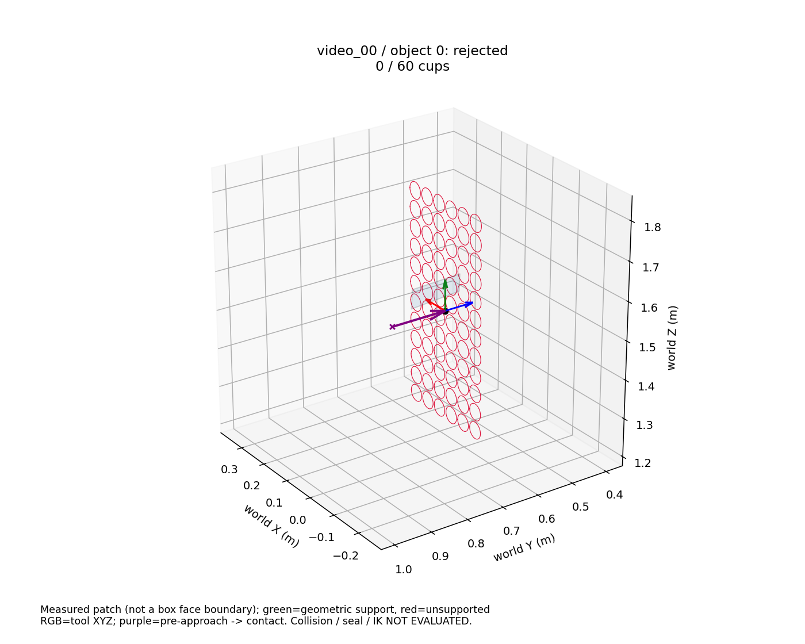
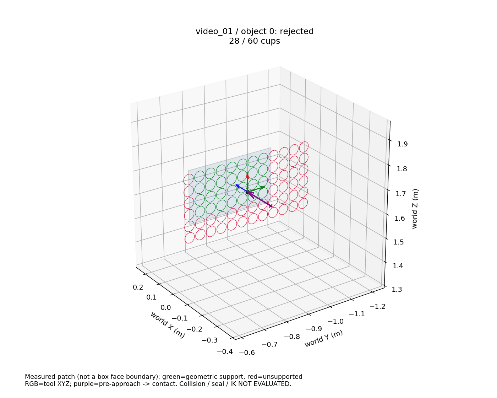

# 已验证观测面的局部吸具接触候选

实际基线 `c5c1a53be34d8b21b951b8f274022fdf995f197f`，分支 `feat/v0.5-perception-ros2`。
开始时工作区干净，fetch 后与 origin 无差异。新增显式离线适配，不替换原 OBB 抓取路径。
没有改变 SAM、米制拟合、融合、尺寸先验、线程策略或执行门控。
核心版本保持 `0.5.0.dev0`；ROS bridge `1.2.2`、interfaces `1.2.0`、contracts `1.1.0` 均未修改、未升版。

本次真实结果：65 个融合对象全部检查，127 个代表观测面构造 4572 个有限接触姿态，
**没有候选达到当前吸具的最低 60 杯要求**。单候选最高 30 杯。
这是当前认证支持区域和固定候选网格下的证据不足，不证明完整物理箱面一定放不下吸具。
没有缩小吸具、降低门槛、换对象或用 GT 补齐表面。

## 工程配置及坐标

当前工作单元沿 `configs/isaac/perception_validation.yaml` 的 M710iD/70 场景合同，
关联 `configs/validation/m710id70_v3.yaml`、`configs/tools/unloading_gripper_20kg.yaml` 和
`assets/grippers/shanghai_wantai_three_zone/mass_properties.json`。
适配代码只读取这三份工程配置，不读取场景实例变换或箱体 GT。
源文件 SHA 和完整配置见 [frozen_plan.json](evidence/surface-contacts-20260928/frozen_plan.json)。

| 项目 | 本次使用值与来源 |
|---|---|
| 吸具 | Shanghai Wantai 三分区 20 kg 工作单元吸具，非 ECO65 |
| 布局 | 6 行 × 12 列，72 杯，双轴中心距均 0.048 m，杯唇半径 0.0215 m |
| 支持门槛 | 原配置最低 60 杯；允许部分杯工作；原模型只有总数门槛，没有额外分区最低值 |
| 编号及分区 | 复用列优先编号 `column * rows + row`；每区连续 4 列，共 24 杯 |
| 分区来源限制 | 资产中注明 `equal_contiguous_columns_inferred_pending_vendor_confirmation`，并非厂家确认的管路分区 |
| 接触覆盖外接尺寸 | task TCP 平面中短轴 0.283 m、长轴 0.571 m（中心跨度 + 杯直径）；不是刚体外形 |
| 刚性几何 | 配置整体外形 0.576 × 0.288 × 0.250 m；板体 0.288 × 0.576 × 0.024 m，中心在工作面后方 0.0655 m；本轮不做碰撞检查 |
| 边缘余量 | 0 m，沿用当前配置，不为本轮减小；仍必须容纳整个杯盘 |
| 预接近 | 外侧 0.15 m，沿用当前 planning 配置 |
| 接触间隙 | 0 m，沿用 `validation_motion.evaluate_task → fanuc_m710id70.target_pose` 的接触面定位；不能把资产中的杯压缩量当作接触间隙 |
| 网格/绕法向角度 | 面内两轴各 `[-0.42, 0, 0.42]`，复用现有候选生成器默认 fraction；roll `[0,90,180,270]` 度来自当前配置，每面 36 个姿态 |

保留世界 +X 入车厢、+Y 向左、+Z 向上以及 SI 单位。平面外法向来自认证观测面，
task TCP 的 +Z 指向面内，`R = make_tool_rotation(-outward_normal)`。
接触参考原点位于观测平面，预接近点为接触点加 `0.15 * outward_normal`，不会反向进入箱内。
机械 TCP 在法兰坐标中平移 `[0.25,0,0]` m，姿态为 I；与现有 `ValidationConfig.robot` 一致，
`T_flange_task = T_flange_mechanical @ Ry(pi/2)`。
报告分别保存接触参考位姿、task TCP 的 grasp/pregrasp、机械 TCP 及法兰位姿，不混用这些原点。

## 适配及证据范围

`unloading_perception.surface_contacts.face_candidates` 输入已认证 observed_surface、对应冻结 record、
绑定 depth/mask/K、工程吸具配置和 artifact/object 身份。没有 OBB 或 GT 输入。
`tools/derive_surface_contacts.py` 从已验证 artifact 显式调用它，遍历预先冻结的全部融合对象。
复用 `load_algorithm_artifact` 的模块、来源及文件哈希核验，再核对采集时 T_W_C、标定身份、深度语义、
mask 内容和 `support_capture_binding`。world 面与原 camera 面、投影边界必须对应。
坐标有限值、法向、平面一致性、变换、正尺寸和有界候选配置均在检查范围内。
本入口当前限于已有的无畸变、理想注册 optical-Z 数据；其他相机模型明确拒绝，不隐式变换。

二维搜索原点只是观测面片的局部搜索参考，不是箱面中心。四角只是认证的内接面片边界，
不作为物理箱角，也不使用尺寸先验包络表面。每个杯的完整圆盘（比仅检查杯唇更保守）必须
落在该面片内；然后将包含圆盘的方形投影到原图，对可能与圆盘相交的所有像素格检查冻结支持。
用像素中心和四角与认证平面的交点界定像素格覆盖上界，不稀疏采样杯圆周。
冻结支持继续与原实例 mask、有效深度及既有 observation_support 相交，保留 2 px 腐蚀及原深度边缘处理。
孔洞、遮挡、无效深度、裁切不能由四边形或凸包补平。

每个覆盖深度样本相对认证平面的误差必须不超过现有 `MetricFitConfig.maximum_mean_m = 0.003 m`。
这是显式的逐点局部检查，比原平均残差门槛更严格，未放宽拟合；它不是位姿 covariance、
材料密封容差、概率或对连续真实材料平整性的证明。离散像素之间的真实材料气密性仍未知。

只使用原融合 `face_reduction.representatives`，不拼接多个相机面片，不累计不同面上的杯数。
关联冲突/歧义不产出支持候选；无面对象保留明确原因。候选按支持杯数排序，同分保留网格/roll 顺序。
每个候选记录来源 artifact/capture/object/face、配置指纹、原采集时间、杯编号、分区数、逐杯拒绝原因和检查数量。

包装类 `ContactCandidate.candidate` 是现有 `SuctionGraspCandidate`，复用其接触点、法向、grasp/pregrasp、
score 和杯编号字段。已有 `select_fast_suction_candidates(..., face_modes=('observed_surface',))` 能显式消费它，
测试覆盖此接口。本轮没有将其接入运动规划。
`sealed_cup_indices` 在此包装中的语义明确是几何预测，不是实测密封。
`pose_status=CONSTRUCTED` 与 `support_status=GEOMETRIC_SUPPORT / INSUFFICIENT_SUPPORTED_CUPS` 分开。
被拒绝的构造姿态也保存，只有明确通过 support_status 的候选才有局部支持。

## 固定真实输入与结果

来源为上一轮 `resident-geometry-ros-20260928/demo-01` 的 video_00/frame 32 和 video_01/frame 602。
定位及身份来自上一轮已提交 [verification.json](evidence/resident-geometry-ros-20260928/verification.json)。
两组全部对象和可视化选择规则在候选生成前写入 frozen_plan；两帧独立处理，没有跨帧稳定目标 ID 声明。
输入 artifact SHA 分别为：

- video_00：`ab0f0f5de7d476b9eb21b323ed82b1130e3616526c24845b4c40ef30e2841767`
- video_01：`3129c890d63f49b82d3b3ea46628f1d89a4f95b5188666376fdaf893d666496b`

| 组/帧 | 原采集时间（ros_sim_time，s） | 对象 | 原始面/代表面 | 构造姿态 | 支持通过 | 最多支持杯 | 原 artifact unknown |
|---|---:|---:|---:|---:|---:|---:|---:|
| video_00 / 32 | 0.5333333611488342 | 37 | 68 / 67 | 2412 | 0 | 30 / 60 | 84 |
| video_01 / 602 | 10.033333856612444 | 28 | 60 / 60 | 2160 | 0 | 30 / 60 | 64 |

原始面 68→67 沿用既有多相机代表面归并，没有重复计作支持。
video_00 有一个对象无认证面，其余 64 个对象均未达到杯数要求。
以下是所有尝试上的逐杯拒绝统计；它不是独立物体或独立杯的数量：

| 杯级原因 | frame 32 | frame 602 |
|---|---:|---:|
| CUP_LIP_OUTSIDE_OBSERVED_PATCH | 140756 | 133144 |
| HOLE_OCCLUSION_INVALID_OR_ERODED_SUPPORT | 988 | 396 |
| LOCAL_DEPTH_PLANE_ERROR | 0 | 4 |

完整逐对象最佳位姿、来源、分区、拒绝计数及全部候选文件哈希在
[summary.json](evidence/surface-contacts-20260928/summary.json)。所有候选保存在独立服务器目录，未覆盖原产物。
[postcheck.json](evidence/surface-contacts-20260928/postcheck.json) 独立复核全部 65 个文件哈希、4572 个身份、
杯数/状态、阻塞状态及原 artifact 哈希；也记录本次实际运行源码哈希，与提交前本地代码核对一致。

逐对象表中的 `不足` = INSUFFICIENT_SUPPORTED_CUPS；所有对象仍有 volume UNKNOWN、IK/碰撞/吸附力/动力学
NOT_EVALUATED、execution BLOCKED。最佳杯数相同不代表姿态相同，完整矩阵见上述摘要。

### video_00 全部对象

| 序号 | 对象 | 原始/代表面 | 姿态数 | 通过数 | 最佳杯数 | 原因 |
|---:|---|---:|---:|---:|---:|---|
| 0 | fusion-770c9865405b396397a7 | 1/1 | 36 | 0 | 0 | 不足 |
| 1 | fusion-b764f8e4c1663d865647 | 2/2 | 72 | 0 | 30 | 不足 |
| 2 | fusion-f810929170299f308d70 | 3/3 | 108 | 0 | 29 | 不足 |
| 3 | fusion-65ddb0c09edf6d63f324 | 1/1 | 36 | 0 | 28 | 不足 |
| 4 | fusion-62411c13a3a5e3171f5e | 1/1 | 36 | 0 | 28 | 不足 |
| 5 | fusion-d42427b0ebc84abb2fd3 | 2/2 | 72 | 0 | 28 | 不足 |
| 6 | fusion-51442e1c9199e32b7ecc | 1/1 | 36 | 0 | 28 | 不足 |
| 7 | fusion-f84878edf245e587d99d | 1/1 | 36 | 0 | 4 | 不足 |
| 8 | fusion-c9f2ad5606e331e322d1 | 4/4 | 144 | 0 | 28 | 不足 |
| 9 | fusion-54d4c0885201aff09f0d | 4/3 | 108 | 0 | 28 | 不足 |
| 10 | fusion-8e7142029b0cf02438c5 | 3/3 | 108 | 0 | 28 | 不足 |
| 11 | fusion-4db1d6323d02d4a0aa6c | 2/2 | 72 | 0 | 30 | 不足 |
| 12 | fusion-4b72918b0eaf985773e1 | 2/2 | 72 | 0 | 30 | 不足 |
| 13 | fusion-1f40e623927dbfb0950d | 3/3 | 108 | 0 | 30 | 不足 |
| 14 | fusion-6075f683e1dd8735e729 | 2/2 | 72 | 0 | 30 | 不足 |
| 15 | fusion-6df1d558c8c13dfd4d25 | 4/4 | 144 | 0 | 30 | 不足 |
| 16 | fusion-29e6f3f1b2d4b7289127 | 0/0 | 0 | 0 | — | 无认证观测面 |
| 17 | fusion-9856da667aaa508ad36d | 1/1 | 36 | 0 | 28 | 不足 |
| 18 | fusion-6af8f3f820ae44d48874 | 1/1 | 36 | 0 | 28 | 不足 |
| 19 | fusion-28bc5809f75edaa9e8b2 | 2/2 | 72 | 0 | 24 | 不足 |
| 20 | fusion-f09604bb4743dbec0159 | 1/1 | 36 | 0 | 24 | 不足 |
| 21 | fusion-d81684abe156d5ce753a | 2/2 | 72 | 0 | 24 | 不足 |
| 22 | fusion-1979274fe10310a99bd0 | 1/1 | 36 | 0 | 28 | 不足 |
| 23 | fusion-8a62abc60f8e24ab4a7b | 1/1 | 36 | 0 | 28 | 不足 |
| 24 | fusion-149f607bf8a1f204e5dc | 2/2 | 72 | 0 | 24 | 不足 |
| 25 | fusion-08e03e4c3611528bb89a | 2/2 | 72 | 0 | 24 | 不足 |
| 26 | fusion-87566f319536c373f299 | 2/2 | 72 | 0 | 24 | 不足 |
| 27 | fusion-866da4be75975337763b | 3/3 | 108 | 0 | 21 | 不足 |
| 28 | fusion-1b688b71e5f884215019 | 1/1 | 36 | 0 | 27 | 不足 |
| 29 | fusion-5f8ab6565cc3cb5edfdc | 1/1 | 36 | 0 | 28 | 不足 |
| 30 | fusion-38aa471fde3e79bcbcbb | 2/2 | 72 | 0 | 18 | 不足 |
| 31 | fusion-e426b292886ba4e073ba | 2/2 | 72 | 0 | 19 | 不足 |
| 32 | fusion-f421f6a70d4fc4c2adf7 | 1/1 | 36 | 0 | 20 | 不足 |
| 33 | fusion-d833f74bbcf1bc35c224 | 1/1 | 36 | 0 | 21 | 不足 |
| 34 | fusion-5ddb2acf6aa9a4fa9852 | 3/3 | 108 | 0 | 28 | 不足 |
| 35 | fusion-3240948f22e4a9b12ab6 | 2/2 | 72 | 0 | 22 | 不足 |
| 36 | fusion-834b1ea258368e6abee2 | 1/1 | 36 | 0 | 2 | 不足 |

### video_01 全部对象

| 序号 | 对象 | 原始/代表面 | 姿态数 | 通过数 | 最佳杯数 | 原因 |
|---:|---|---:|---:|---:|---:|---|
| 0 | fusion-4e0241dcc2df871d5cc5 | 5/5 | 180 | 0 | 28 | 不足 |
| 1 | fusion-ef93be8d7453742f20a5 | 1/1 | 36 | 0 | 28 | 不足 |
| 2 | fusion-c65a267b060ef951cf22 | 2/2 | 72 | 0 | 28 | 不足 |
| 3 | fusion-b71fbdca461a2483b685 | 1/1 | 36 | 0 | 16 | 不足 |
| 4 | fusion-f4b0004ca9bfae2e331b | 3/3 | 108 | 0 | 28 | 不足 |
| 5 | fusion-a794a24611526d360a48 | 4/4 | 144 | 0 | 28 | 不足 |
| 6 | fusion-76f73be33cc29b8675e8 | 2/2 | 72 | 0 | 18 | 不足 |
| 7 | fusion-808e1cd7b98c3681839d | 4/4 | 144 | 0 | 30 | 不足 |
| 8 | fusion-5bcf4ebdac9b98c5d7ab | 2/2 | 72 | 0 | 30 | 不足 |
| 9 | fusion-68410278c4600057c34f | 4/4 | 144 | 0 | 30 | 不足 |
| 10 | fusion-73349c2e1668167a17ad | 2/2 | 72 | 0 | 20 | 不足 |
| 11 | fusion-9c363e2131b2f853d13d | 1/1 | 36 | 0 | 28 | 不足 |
| 12 | fusion-cd5112c36125f5dde690 | 3/3 | 108 | 0 | 21 | 不足 |
| 13 | fusion-487d55d875291b94c7c0 | 2/2 | 72 | 0 | 24 | 不足 |
| 14 | fusion-5cc45cb33772e31da8f7 | 2/2 | 72 | 0 | 24 | 不足 |
| 15 | fusion-de45fee53d90765c5c6e | 1/1 | 36 | 0 | 8 | 不足 |
| 16 | fusion-cfed1a2888d579afe0ba | 2/2 | 72 | 0 | 24 | 不足 |
| 17 | fusion-8a9c1ce363121e35b5d8 | 1/1 | 36 | 0 | 24 | 不足 |
| 18 | fusion-ac960e0f60a6ea57bb14 | 2/2 | 72 | 0 | 24 | 不足 |
| 19 | fusion-f63d9388db66bf4ca23e | 1/1 | 36 | 0 | 10 | 不足 |
| 20 | fusion-166a474f97a710e1f952 | 1/1 | 36 | 0 | 18 | 不足 |
| 21 | fusion-eb560d6ada77a821e486 | 2/2 | 72 | 0 | 13 | 不足 |
| 22 | fusion-3d7fead4c9737dbf4d18 | 1/1 | 36 | 0 | 3 | 不足 |
| 23 | fusion-a42107cda077a3f2af44 | 2/2 | 72 | 0 | 24 | 不足 |
| 24 | fusion-be5ec75e8745a8c678a0 | 2/2 | 72 | 0 | 24 | 不足 |
| 25 | fusion-1445fce8067043309954 | 4/4 | 144 | 0 | 1 | 不足 |
| 26 | fusion-2e4b0d0e7fa1fa2b366c | 1/1 | 36 | 0 | 6 | 不足 |
| 27 | fusion-072ee9953722d213024a | 2/2 | 72 | 0 | 24 | 不足 |

### 代表位姿与可视化

两组杯数最多的被拒绝候选分别来自 `fusion-b764f8e4c1663d865647` 和 `fusion-808e1cd7b98c3681839d`。
以下数值仅为文档展示舍入；JSON 原始精度、身份和哈希不变：

| 帧 | 世界接触点 m | 世界预接近点 m | 外法向 | 工具旋转矩阵的列（世界坐标） | 杯数/分区 |
|---|---|---|---|---|---|
| 32 | (0.000000081, 0.419744266, 1.893433584) | (-0.149999919, 0.419744265, 1.893433582) | 约 (-1,0,0) | 约 (0,1,0), (0,0,1), (1,0,0) | 30；(0,18,12) |
| 602 | (0.000000069, -0.837267547, 1.893433588) | (-0.149999931, -0.837267544, 1.893433589) | 约 (-1,0,0) | 约 (0,1,0), (0,0,1), (1,0,0) | 30；(0,18,12) |

图像按冻结规则选择每组第一个拒绝对象（而非事后挑选最佳），已实际打开检查：
frame 32 的对象 0 支持 0/60，frame 602 的对象 0 支持 28/60。
蓝色区域是实际认证面片；杯盘绿色为几何支持、红色为不足；黑点是接触参考，RGB 是工具坐标轴，
紫色为预接近到接触的方向。两组没有有效候选，因此没有伪造有效案例或替换小吸具。





## 运行及测试

独立输出根目录为 `/root/autodl-tmp/v05-acceptance/surface-contacts-20260928`，下称 BASE。
代码为基线隔离副本加本轮源文件；未切换用户工作区或其他功能分支。实际完成命令：

```bash
BASE=/root/autodl-tmp/v05-acceptance/surface-contacts-20260928
/root/v05-gpu-venv/bin/python "$BASE/code/tools/derive_surface_contacts.py"   --plan "$BASE/plan.json" --output "$BASE/run-02" --visualize
```

重新使用时指定不存在的新 output 目录。plan 的格式为
`{"groups":[{"name":"video_00","artifact":{"path":"完整 artifact 路径","sha256":"已固定 SHA"}}]}`。
CLI 在处理前验证 artifact 和配置，冻结全部对象清单，输出目录必须位于原 artifact 目录以外。

最初 run-01 在加载元数据时因 JSON list 与契约 tuple 直接比较误报 `CONTACT_CAPTURE_CALIBRATION_MISMATCH`，
未生成候选。修复为数值精确相等比较 `np.array_equal`，没有放宽标定容差；补充真实编码路径的 CPU 回归。
run-01 的 failure.json、冻结计划及日志原样保留，错误记录也在 postcheck.json。
run-02 使用相同清单和参数，是本轮唯一完成的真实适配；没有重跑模型或重建。

轻量适配计时：墙钟 **63.5764359813 s**，当前进程 CPU **262.8750117 s**。
计时覆盖开始循环后的支持/模块加载、局部候选、JSON 和两幅图；不包含计时前的首次总 artifact 校验及冻结计划写入，
也不包含任何此前 SAM/几何运行。它不是完整感知时延或 A/B 测试；CPU 秒数不能当作墙钟延迟。
数值库继承现有配置，本轮没有线程 setter、搜索或性能优化。

本地 `.venv310/Scripts/python.exe -m pytest -q` 实际运行：

```text
tests/test_surface_contacts.py tests/test_geometry.py tests/test_observed_faces.py
tests/test_planning_geometry.py tests/test_algorithm_artifact.py
tests/test_metric_support_window.py tests/test_final_geometry.py
--basetemp=tmp/surface-contact-final-regression
115 passed in 10.06s

tests/test_planning_flexibility.py -k "suction or cup or footprint or candidate or roll"
--basetemp=tmp/surface-contact-obb
4 passed, 17 deselected in 0.35s
```

其中新增适配测试 27 项，包括旋转面/顶面/侧面、外侧预接近及 TCP/法兰关系、完整杯唇跨界、
孔洞/遮挡/坏深度/裁切、72 杯及部分 60 杯支持、原有分区和门槛、退化输入/坏法向/坐标/尺寸、
采集绑定与坏哈希、重复面与冲突、确定性、空面、已有候选消费者和历史执行门控。
测试中的合成平面支持成功和 CPU 模型替身仅验证代码，不冒充真实 SAM 或真实吸附实验。
原 OBB 候选仅提取共享布局函数，专项回归通过；原正常输入行为和规划默认路径不变。

未运行全量测试、SAM、米制重建、视频、Isaac、ROS/RViz、IK/RRT、机器人或吸附实验。
原始 observation、candidate_eligible、unknown、capture_time、clock_domain、来源指纹未改；
前后 observation 指纹和原 artifact 哈希复核保持一致。
保留 ORACLE-PROMPTED、raw_image_automatic=false、HISTORICAL_REPLAY_DISPLAY_ONLY 和 planning_admissible=false。
本轮没有计算新保守体积，没有解决完整吸具碰撞、可达性、带载搬运、真空密封、吸附力或授权条件。
图和候选只交付局部几何证据，不授予执行资格。
