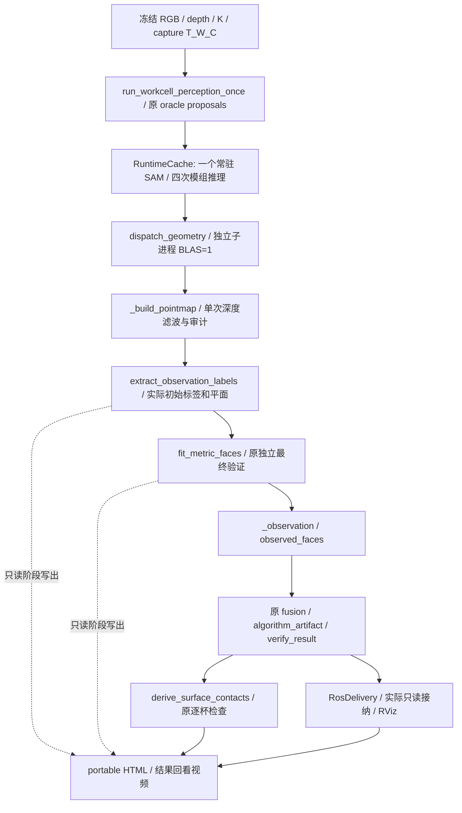

# 逐阶段感知可视化与两组真实运行（2026-10-02）

## 打开结果

GitHub 下载：[本轮完整结果 Release](https://github.com/QGG716/pick-and-place-simulation/releases/tag/perception-stage-20261002)。
优先下载 `perception-stage-viewer.zip` 后解压打开。Release 同时提供两段独立 MP4、
`perception-stage-full-results.tar.gz`（772个新运行结果文件，包括阶段数组、完整接触候选、
ROS回执、日志和固定计划）、明确标为历史开发回看的包，以及逐文件/逐附件 SHA256 清单。
源码对应 `4e0c9eec0342ef999a5095f91bb80252eee91c7d`；大附件放在 Release，不写入 Git 历史。
不分发模型权重、临时中文字体、私有源资产或重复代码检出；原录像全集不在结果附件内，
保留原输入绑定与哈希引用。附件索引见 [release-manifest.json](evidence/stage-visual-20261002/release-manifest.json)。

本地交付目录为 `outputs/stage-visual-20261002/viewer/`。Windows 双击其中的
`打开查看器.cmd` 或 `index.html`；不需要网络、CDN、Python 服务或再次推理。
选择 frame32 / frame602、上下模组、SAM 实例、融合对象和接触候选；左右切换阶段，
三维画布可拖动/缩放，图片链接打开原分辨率或原生像素裁剪。全部失败对象也保留。

- `algorithm-review.mp4`：1920×1080，120 秒，两组各十阶段；每页停留 6 秒，
  是本次计算结果回看，页面单列真实计算耗时，不是实时推理视频。
- `ros-rviz.mp4`：1920×1080，49.5 秒，本次真实 RViz 原速录屏，包括两组接纳和切换。
- `keyframes/frame32/01.png` 至 `10.png`、`keyframes/frame602/01.png` 至 `10.png`：阶段关键图。
- `data.json`、`assets/`、`evidence/`、`delivery-manifest.json`：可搬移数据与来源证据。
- 同级 `perception-stage-viewer.zip`：94,231,114 字节，SHA256
  `eb83a49cd105e99305de406a6f42679d87f84f4b13dc5cbf4eafdb6409b8d1aa`。

802 个包内资源已在 Windows 本地逐个核对 SHA；两段视频经 FFmpeg 全文件解码通过。
实际检查了中文初始平面、逐杯拒绝关键帧及真实 RViz 截图。**Windows 浏览器交互与播放器播放
未验证**：Computer Use 因无法确认浏览器 URL 而停止，专用浏览器连接器也无可用浏览器。
没有绕过该限制；截图和视频解码不替代交互验收。

## 基线、范围和真实调用链

实际基线 `27a541a1befb53e9dd374c78f86daffc8c14747a`，分支
`feat/v0.5-perception-ros2`，开始时工作区干净，远端无新增提交。
仅增加可选 trace、固定输入编排、导出、离线查看器和 ROS 只读回看工具。
没有修改核心数学、阈值、采样、吸具、场景、相机、融合、执行门控或 ROS 包源码。
core `0.5.0.dev0`、ROS bridge `1.2.2`、interfaces `1.2.0`、contracts `1.1.0` 保持原版。



`--stage-trace` 默认关闭。开启后只在真实提取与拟合返回处保存阶段边界，
初始标签先于拟合落盘，不重新运行另一套拟合器，也不把最终平面伪称初始平面。
NPZ/JSON 完整写入后原子替换，进度列出已完成事件；缺失、坏 hash、串 capture、
多余/重复事件或实例清单不完整时，新运行导出失败。合法无面片结果可完整展示。

MoGe 与显式尺寸先验分支本次均 `NOT_RUN`，legacy cuboid diagnostic 保持关闭。
没有启动 Isaac、执行桥、机器人、IK/RRT 或做线程/性能 A/B。

## 固定输入与新结果

服务器独立输出根目录：`/root/autodl-tmp/v05-acceptance/stage-visual-20261002`。
原录制索引 `video-demo-20260920/recording-01/sequence-prefix.json` 的 SHA256：
`1e2ade756e33b88d39c95e4e2f2374e7e590a59c011db19675425909f2239cfc`。
顺序固定为帧32（原目录 `frames/000000`）和帧602（`frames/000095`），均为
2592×1944 双模组，处理全部 SAM 实例。采集中断仍记录为原 `000096` 缺 binding，
没有补采、跳坏帧拼数据。完整 RGB/depth/K/T_W_C、模型、输入 hash、配置在
[frozen_plan.json](evidence/stage-visual-20261002/frozen_plan.json)，冻结早于模型初始化。

| 项目 | frame32 | frame602 |
|---|---:|---:|
| 原采集时间（ros_sim_time，s） | 0.5333333611488342 | 10.033333856612444 |
| 新 run_id | ffcec9a460f24a9ab528cec06b6afef6 | d876212cf81e460d963fb7bbfb4074f9 |
| 上 / 下模组 SAM 实例 | 16 / 31 | 12 / 24 |
| 上 / 下原观测面片 | 23 / 45 | 19 / 41 |
| 融合对象 / 代表面 | 37 / 67 | 28 / 60 |
| artifact 原 unknown / ROS world unknown | 84 / 121 | 64 / 92 |
| 局部接触候选 / 支持通过 | 2412 / 0 | 2160 / 0 |
| 所有候选最高支持杯数 / 原最低杯数 | 30 / 60 | 30 / 60 |
| 算法含 trace 墙钟（s） | 154.547944 | 118.781813 |
| ROS 请求至真实接纳（s） | 14.370271 | 14.341603 |
| ROS 接纳 | ROS_ACCEPTED | ROS_ACCEPTED |

ROS world 额外保留各未知体积对象的阻塞区域，不能把上述两类 unknown 计数混用。
ROS 请求时间包含原 5 秒初始化和 5 秒稳态检查；第一份 world 分别在 2.665 / 2.823 秒到达。
它不是从仿真源时间计算出的端到端时延。本次先完成两组算法，再只读交付 ROS。

SAM 父进程 PID 5070，RuntimeCache 两组记录均为 loads=1 且对象身份相同。
几何 PID 按模组顺序为 5417、5731、6051、6364；每个进程计算前后 NumPy/SciPy
BLAS getter 均为1，OpenCV调度仍22。父进程未施加子进程策略。
环境 Python3.10.12、NumPy1.26.4、SciPy1.14.1、OpenCV4.10.0；可见208CPU，
cgroup CPU配额为 `2200000/100000`（22CPU时间预算），不是208核独占。
详细进程 CPU/RSS/cgroup 读数保留于 [verification.json](evidence/stage-visual-20261002/verification.json)。

所有83实例均记录初始/拟合两个事件，共166事件。与既有固定输入结果核对：
四组 SAM ID/顺序/全部 mask 像素精确一致，83份完整几何实例记录（含残差、支持与判定）
精确一致。4572个接触候选逐项位置、姿态、杯数、杯检查、顺序及支持字段精确一致。
新运行身份和真实 artifact hash 保持新值；没有伪造为历史身份。
历史产物仅用于开发标为 `HISTORICAL_REVIEW` 的查看器和独立结果对照，最终页面/视频使用新推理。

## 从页面能看到的问题

1. **分割**：本次独立评价没有达到其合并/重复判据的对象；帧32上下各有一个对象
   best IoU低于0.5，帧602没有。四模组渲染轮廓2px精度仅0.509、0.604、0.538、0.585，
   说明边界偏差从 SAM 已存在，实例数量正确不等于边界正确。评价参照是实际渲染 mask
   轮廓（含遮挡/裁切边），未评价精确 mesh 平面角点，GT 不参与正式面片/接触补全。
2. **面片**：显示真实初始标签、平面与支持点，继而对比最终法向、位置、残差和独立验证。
   原有效支持与内接四边形分别着色；四边形会丢失部分观测区域，不能当完整箱面或物理箱角。
   初始平面的绘图范围只是显示范围。frame32 的 `fusion-29e6f3f1b2d4b7289127`
   无认证面，保留 `NO_CERTIFIED_OBSERVED_FACE`，不伪造候选。
3. **融合**：帧32有10个按世界面几何关联的对象、27个未关联保留；帧602为8和20。
   帧32的68个原面变成67个代表面，帧602为60到60。融合不扩大吸附支持区域，
   不填补未观测体积，也没有跨帧稳定ID。查看器保留原成员与关联诊断，能回到模组原图。
4. **吸盘支持**：当前上海万泰吸具6×12杯、间距48mm、杯半径21.5mm、最低60杯，
   外形576×288×250mm，预接近150mm，沿用当前零额外边缘余量/接触间隙，未降低要求。
   两组最多只支持30杯。全部候选中越出内接面片的杯检查分别140756/133144次，
   孔洞/遮挡/无效或腐蚀支持988/396次，第二组另4次局部深度误差；这些是跨候选
   累计检查数，不是物理杯数量。三分区沿原等列推断配置，仍待厂商确认，未新增分区门槛。
   绿色几何支持、橙色越界、红色无效支持、紫色局部误差、粉色裁切并配逐杯文字。
   视频固定每组第一个融合对象并沿用原最佳候选，即使全拒绝；第一组示例甚至0杯，
   第二组示例28/60杯，未选更有利对象美化结果。

查看器点云为显示而确定性抽稀（常规最多2000点、初始每标签最多350点），显示采样数与
总点数分列；算法全分辨率及统计不变。初始显示采样残差明确标为显示统计，
不能充当全支持域验收残差。接触位姿、任务TCP、机械TCP、法兰、杯唇和预接近关系来自
原候选数据，不是机器人轨迹。体积 UNKNOWN；IK、碰撞、吸附力、气密性、动力学
均 NOT_EVALUATED，执行 BLOCKED。

两组的真实 ROS 回执均无动作授权，保持 `planning_admissible=false`、历史回放和
`raw_image_automatic=false`。第二组回执确认删除134个旧Marker；图像订阅最后10条
均为对应的新组身份与源时间。RViz 同时显示该组 RGB/SAM 与来源绑定的云和面片。
运行结束后自有 ROS、RViz、录屏、Xvfb 进程均回收；受信号关闭的进程非零码在证据保留，
不冒称所有进程自然返回0。

## 耗时、复现入口与测试

两组接触适配合计62.746秒（含加载/审计/派生文件），查看器导出56.605秒，
视频渲染13.276秒。算法154.548/118.782秒包含 trace 开销，不作性能优化结论。
trace的 observer_payload 计时只覆盖载荷写入，不覆盖初始化hash与进度索引写入；
各嵌套阶段不能直接相加。逐模组 SAM、点图写出、拟合、独立验证耗时均在证据和页面。

在现有环境、显式设置项目路径与原模型清单后使用（输出目录须是新目录）：

```sh
"$ALGORITHM_PYTHON" tools/run_perception_stage_capture.py --plan "$FIXED_PLAN" \
  --output "$NEW_RUN" --models "$MODEL_MANIFEST" --vision "$PINNED_VISION"
"$ALGORITHM_PYTHON" tools/derive_surface_contacts.py --plan "$CONTACT_PLAN" --output "$CONTACT_OUTPUT"
# 已 source Humble 和本分支既有 install；无执行桥
/usr/bin/python3 tools/replay_stage_results_ros.py --run "$NEW_RUN" --output "$ROS_OUTPUT" \
  --domain "$ISOLATED_ROS_DOMAIN" --font "$EXISTING_CJK_FONT"
"$ALGORITHM_PYTHON" tools/build_perception_stage_viewer.py --plan "$CONTACT_PLAN" \
  --contacts "$CONTACT_OUTPUT" --output "$VIEWER" --origin NEW_ALGORITHM_RUN --ros "$ROS_OUTPUT"
"$ALGORITHM_PYTHON" tools/render_perception_stage_video.py --viewer "$VIEWER" --font "$EXISTING_CJK_FONT"
```

固定计划实际已执行一次，不需再次运行即可打开交付包。独立录屏使用现有 RViz 配置，
未改布局；没有安装/升级依赖。提供的中文字体仅临时引用已有本地字体，不入库或再分发。

定向命令：

```text
.venv310/Scripts/python.exe -m pytest -q tests/test_perception_stage_trace.py tests/test_perception_stage_viewer.py tests/test_workcell_perception_once.py tests/test_workcell_geometry_process.py tests/test_optional_legacy_diagnostic.py tests/test_surface_contacts.py tests/test_final_geometry.py tests/test_finite_sequence.py -p no:cacheprovider --basetemp=tmp/stage-final-tests
170 passed, 2 skipped in 77.63s
```

后增来源/事件顺序检查后，viewer专项13 passed；JS `node --check`通过，`git diff --check`通过。
Windows缺cv2的实际拟合trace等价测试在现有GPU Python中补跑，与真实入口参数传递测试合计
2 passed；提取器为明确合成替身，拟合调用生产实现。另一跳过为既有POSIX限定测试。
首次Windows测试因cv2缺失失败记录保留，后明确平台跳过并在具备cv2的环境验证；
开发导出中的mappingproxy序列化、合法空初始平面字段处理仅作展示侧最小修复，未重跑算法。
未运行无关全量Humble/Isaac/执行链或完整仓库测试，遵照本轮定向验证范围。

新增文件为 `perception_stage_trace`、固定capture、viewer导出/HTML、视频渲染、只读ROS
回看工具及两项专项测试；原四个入口只透传默认关闭的trace。大图/视频/原数组保留独立目录，
仓库仅提交少量实际关键图、冻结计划、对照和验证记录。未解决Windows交互验收，未证明
实物相机、全自动提示、连续跟踪、完整重建、真空密封或执行资格。
