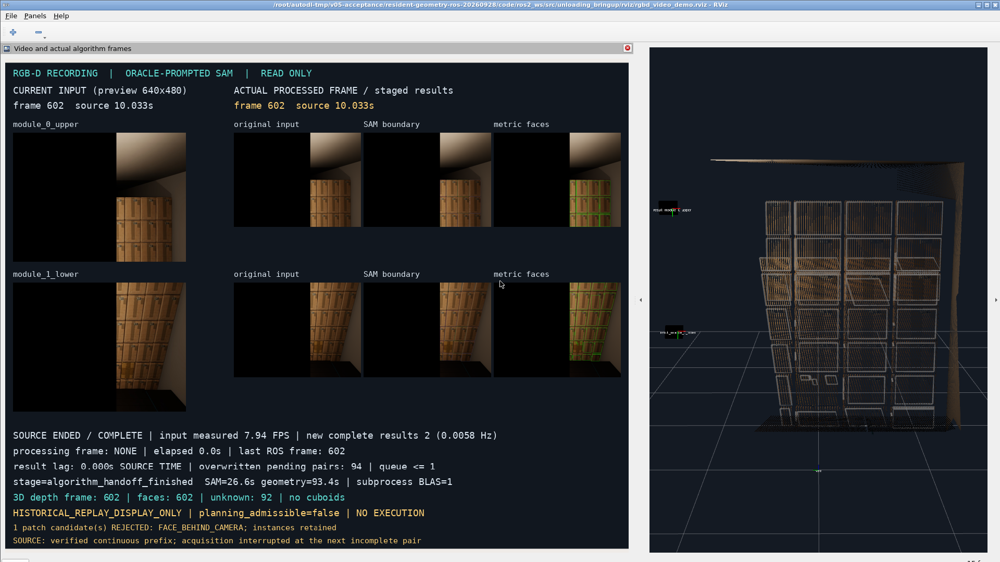

# 常驻 SAM → 几何子进程 → 只读 ROS/RViz

基线 `e49acea529e831cf6515b985d85ac97be9fb3c1c`，分支 `feat/v0.5-perception-ros2`。
开始时工作区干净，fetch 后与 origin 无差异。本轮接通已有入口，没有改动 SAM、米制几何、
融合、尺寸先验或执行算法。ROS 桥 `1.2.1 → 1.2.2`（package.xml/setup.py 同步并重建）；
核心 `0.5.0.dev0`、contracts `1.1.0`、ROS interfaces `1.2.0` 不变。

## 接线和配置

四个选项经过 `run_rgbd_video_demo.sh/.py → VideoDemoNode → workcell_video_worker →
run_workcell_perception_once → dispatch_geometry`。沿用串行子进程调度及其超时、stop、
信号和 wait 回收，没有新增另一套几何流程。默认仍为 inline；inline + 显式线程数在模型启动前拒绝。
顶层省略 geometry-python 时使用 algorithm-python，`absolute()` 保留 venv 符号链接。
ROS 参数 `geometry_blas_threads=0` 仅表示“继承”，转换回 None 后省略 CLI 线程参数；负数拒绝。

`tools/geometry_runtime_config.py` 只依赖标准库，集中参数检查、转发和有效配置构造；原入口保留导入兼容。
ROS 端从受控 YAML 和启动参数生成预期配置，独立写入 expected-config.json，绝不从结果反推预期值。
subprocess 的 `metric_runtime_policy`、`geometry_runtime` 使用原指纹语义。
`verify_result` 保留输入、模型、模块、artifact 哈希及 config_identity 检查，增加当前任务输出目录约束，
核对实际 index.config；subprocess 额外核对融合 observation.config_identity。
旧 inline observation 的配置身份惯例不迁移，原检查继续执行。
本次有效配置指纹为 `b79cf43b39549d4ddedd01d8ba85dbcd8dd2ccd9e616a3c4c7e6f86341f22f7b`。

worker 逐任务保存 PID、同一 SAM 对象身份、加载次数、只读线程快照和 worker-result.json。
线程 getter 不初始化新数值库、不调用 setter。界面只补充 backend/线程策略；原 RViz 布局未改。
结果必须匹配 task/frame/source time，真实回执必须匹配 batch/order/session/artifact 后才计为 ROS_ACCEPTED。

## 唯一一次真实运行

完整独立输出根目录为 `/root/autodl-tmp/v05-acceptance/resident-geometry-ros-20260928`，以下称 BASE。
在推理前保存 [frozen_plan.json](evidence/resident-geometry-ros-20260928/frozen_plan.json)，冻结输入：

- `/root/autodl-tmp/v05-acceptance/video-demo-20260920/recording-01/sequence-prefix.json`
- SHA256 `1e2ade756e33b88d39c95e4e2f2374e7e590a59c011db19675425909f2239cfc`
- 96 组连续合法前缀，帧 32–602，原始 2592×1944；下一不完整采集对导致的中断说明原样保留。
- 原顺序预览、一个处理中任务加一个最新等待帧组、最多两组；94 次等待槽覆盖是既有调度行为。
  实际选中帧 32 与 602，未按推理结果挑帧、补数据或重试。

真实使用 facebook/sam-vit-base revision `70c1a07f894ebb5b307fd9eaaee97b9dfc16068f`，
上游 `1d208f2ed380a207e6e46b4a62d2ac640edfe477`，既有 model-manifest 文件 SHA 已核查。
四次新 SAM metrics 均为 `result_cache_reused=false`，未使用历史 mask 或最终几何代替推理。
原图、深度、K、采集时 T_W_C、时间和来源绑定均经生产校验；原 GT 框仅沿用 ORACLE 提示用途。

实际启动参数如下；PROJECT/OUTPUT 是当前本轮路径，重用时 OUTPUT 必须为新目录：

```bash
BASE=/root/autodl-tmp/v05-acceptance/resident-geometry-ros-20260928
PROJECT="$BASE/code"
OUTPUT="$BASE/demo-01"
HUMBLE_INSTALL="$BASE/install" DISPLAY=:100 LIBGL_ALWAYS_SOFTWARE=1 \
  bash "$PROJECT/tools/run_rgbd_video_demo.sh" \
  --recording /root/autodl-tmp/v05-acceptance/video-demo-20260920/recording-01/sequence-prefix.json \
  --output "$OUTPUT" --models /root/autodl-tmp/v05-acceptance/model-manifest.json \
  --vision /root/vision-fixed --algorithm-python /root/v05-gpu-venv/bin/python \
  --geometry-backend subprocess --geometry-blas-threads 1 --geometry-timeout 1200 \
  --domain-id 179 --record --auto-start --auto-close
```

本次由独立 Xvfb :100 / Openbox 提供桌面，运行的是真实 RViz2/Humble；几何解释器参数有意省略，
[worker-command.json](evidence/resident-geometry-ros-20260928/demo-01/worker-command.json) 证明其继承 GPU venv。
完整启动命令保存在 launch.json。运行后所有本轮所属进程已回收，run-exit.json 为 0、残留列表为空。

| 实际组 | 原采集时间（ros_sim_time） | 新 SAM mask 上/下 | 观测面 上/下 | 融合对象 / 展示代表面 | artifact unknown / ROS scene unknown | ROS |
|---|---:|---:|---:|---:|---:|---|
| video_00，帧 32 | 0.5333333611488342 s | 16 / 31 | 23 / 45 | 37 / 67 | 84 / 121 | ROS_ACCEPTED |
| video_01，帧 602 | 10.033333856612444 s | 12 / 24 | 19 / 41 | 28 / 60 | 64 / 92 | ROS_ACCEPTED |

第一组下模组有 1 个实例无认证面片。第二组上模组 mask 10、label 2 的一个候选面被
`FACE_BEHIND_CAMERA` 拒绝，实例保留。两组完整 cuboid 接受数均为 0。
ROS scene 在原 unknown 之外按原规则增加“缺保守体积”等 unknown；原集合逐项保留，不能要求两个阶段计数相等。
第一组原始 68 个面归并为 67 个展示代表面。第二组切换回执证实删除 134 个旧 Marker，坐标与本组证据匹配。

SAM 父 PID **30690**，同一模型对象 **139616863813536**，两任务累计加载次数均为 **1**。
run_id 分别为 `fcb02c5e3fd148f4859910c6384ce43a`、`bb23515ccfeb4128ba63908be593fb8e`；
SAM request_id 为各 run_id 加模块名，四个几何 task_id 均不同。各次完整 capture、request、
mask 清单、结果 SHA、线程报告及真实 ROS 回执见 [verification.json](evidence/resident-geometry-ros-20260928/verification.json)。
两组 artifact SHA 分别为 `ab0f0f5de7d476b9eb21b323ed82b1130e3616526c24845b4c40ef30e2841767`、
`3129c890d63f49b82d3b3ea46628f1d89a4f95b5188666376fdaf893d666496b`。

## 时延与资源（单次测量，非 A/B）

| 秒 | 帧 32 | 帧 602 |
|---|---:|---:|
| 等待槽排队 | 0.000 | 172.228 |
| runtime_initialize | 3.805 | 0.004 |
| SAM 纯推理（上下合计） | 31.019 | 22.535 |
| sam_inference 阶段（含原 2D 处理） | 35.926 | 26.612 |
| 几何 dispatch（上下合计） | 115.286 | 93.448 |
| 原融合与 artifact 交付阶段 | 3.114 | 2.729 |
| ROS 接收端 artifact 预核验 | 0.252 | 0.224 |
| worker 任务墙钟 | 166.360 | 128.747 |
| ROS 交付提交至确认（含固定 5+5 秒窗口） | 13.889 | 14.498 |
| 任务提交至 ROS 接纳 | **183.122** | **145.562** |
| 该帧进入预览至 ROS 接纳（含排队） | 183.122 | **317.789** |

首组常驻 runtime 启动 3.800 秒，其中模型加载 0.305 秒；第二组复用该对象，worker 保存的启动指标是原值，
不能再计作一次冷启动。父子包含时间不可相加。完整几何分项和每次 request 的 SAM/2D 时间均保存在证据中。

| 组/模组 | 几何 PID | 启动 / 等待 / 父验收（秒） | 几何区间进程 CPU（秒） | /proc 采样 RSS 峰值（MiB） |
|---|---:|---|---:|---:|
| 32 上 | 31320 | 0.0013 / 39.426 / 0.670 | 38.274 | 690.582 |
| 32 下 | 32011 | 0.0015 / 73.865 / 1.243 | 72.697 | 864.727 |
| 602 上 | 32448 | 0.0014 / 31.075 / 0.387 | 30.127 | 641.785 |
| 602 下 | 32846 | 0.0013 / 60.914 / 0.996 | 59.651 | 965.328 |

子进程真实加载 NumPy 1.26.4/OpenBLAS 0.3.23.dev、SciPy 1.14.1/OpenBLAS 0.3.27.dev，
每次计算前后 native getter 均为 **1**；OpenCV 4.10.0 调度 **22**，其自带 BLAS **1** 均未变。
父进程两任务前后的完整只读线程快照一致：NumPy/SciPy 均为 **64**，无 setter 调用路径或环境改写。
affinity 可见 208 CPU；可读 cgroup `cpu.max=2200000 100000` 即 22 CPU 时间配额，未挂载父层未知。
各几何区间 cgroup throttled_usec 增量为 745729 / 5262726 / 593539 / 0，属于共享 cgroup，不能归因于本任务。

每约 2 秒只读采样本轮进程树：父进程最后采样累计 CPU 412.49 秒、RSS 峰值 4219.922 MiB；
父与当前几何子进程同一采样时刻的 RSS 合计峰值也是 4219.922 MiB，不累加不同时刻的峰值。
子进程 getrusage 原始峰值在计算前已为 3432156 / 4616264 KiB，计算后不变，
该指标不能当作本次几何阶段新增内存；上表明确使用 /proc 当次 RSS 采样（可能漏掉短峰）。
采样创建线程数父最多 233、几何最多 148；这不是同时运行的线程数。
NVML 进程采样明确匹配 PID 30690，驻留显存 **3790 MiB**，没有记录到几何 PID 的 CUDA 占用。
另有既存外部 PID 27964 的 GPU 记录，本轮未启动或触碰它，也未计入本任务显存。
共享主机 1 分钟 load 在 7.39–22.27，不能据此推断特定外部进程造成的耗时。

输入预览实测 **7.943 FPS**；从开始至第二次 ROS 接纳约 329.75 秒，仅 **2** 个新完成结果，约 **0.0061 Hz**。
结束保留画面的最终计数约 0.0058 Hz；两段 ROS 稳态接收频率约 3.36 / 4.22 Hz，是心跳而非新结果。
结束时源时间滞后为 0 只表示显示到录像末帧，不表示低处理延迟。

## 验证、可见交付与边界

先完成受影响测试，再开始唯一一次两组真实运行：

```text
.venv310/Scripts/python.exe -m pytest -q tests/test_video_demo.py tests/test_finite_sequence.py
  tests/test_workcell_geometry_process.py tests/test_metric_thread_policy.py tests/test_workcell_perception_once.py
  --basetemp=tmp/ros-geometry-final-cpu
146 passed, 3 skipped（97.42 秒；Windows/缺原生数值依赖相关跳过）

/usr/bin/python3 -m pytest -q ros2_ws/src/unloading_ros_bridge/test/test_video_demo.py
  ros2_ws/src/unloading_ros_bridge/test/test_finite_replay.py
5 passed（25.08 秒；真实 Humble，模型替身与真实 DDS 分别覆盖）
```

新增只读 getter 回归用例另跑 **1 passed**。真实运行结束后补跑受影响的 Linux 原生线程/子进程测试
**66 passed，2 warnings，3.76 秒**，覆盖本地跳过项。GPU venv 未安装 pytest，复用已安装的系统 pytest，
在 venv 数值库之后追加系统包路径并显式给出仓库导入路径；未安装或升级依赖。
旧 pytest 的 pythonpath 配置警告、pkg_resources 弃用警告保留于 native-tests.log。
入库的 native/windows 测试日志副本仅统一 UTF-8 并去掉行末空白，原日志留在独立输出目录。
实际命令为 `/root/v05-gpu-venv/bin/python "$BASE/native-tests.py"`，
该轻量测试启动脚本也归档在证据目录，数值库路径有显式断言。
ROS bridge 用 colcon `--packages-select unloading_ros_bridge --symlink-install` 重建，使用原 interfaces underlay。

测试覆盖四选项实际转发、默认 inline、venv 继承、模型启动前非法参数拒绝、轻量配置导入、有效配置一致、
正确 subprocess 接纳与错误 backend/线程/config、旧任务、错 capture、坏 hash、缺模块拒绝；
真实节点 Marker 切换、算法失败不计 ROS 成功、stop/timeout/SIGTERM 等既有回收测试继续通过。
CPU 编排中的模型/几何替身不算真实 SAM 验收。真实两组运行之后又只读调用 verify_capture、verify_result、
accept_result，检查全部新 SAM 引用、子进程输入/输出 SHA、实例清单、线程报告和真实回执。

开发时先前增加的全模式 observation 配置身份断言暴露 3 个旧 inline 夹具不兼容，已收窄为 subprocess 的新增检查，
原 config_identity 校验未放宽。真实联合运行无技术失败或重试。事后临时归档脚本先遇标准库 inspect 同名遮蔽，
随后误将 artifact unknown 数量与 scene 数量要求相等；按原 scene 保留并增加 unknown 的语义修正归档检查，
未改算法或原运行产物。原生测试启动时缺 pytest、旧 pytest 未处理 pythonpath 的两次收集失败也保留在服务器日志中。



原速录屏：`BASE/demo-01/demo-original-speed.mp4`，1920×1080、10 FPS、346 秒、3405276 字节；
SHA 见 verification.json。没有加速摘要或替代界面。轻量证据约 0.9 MB 入库，完整 world/markers、
RGB-D、mask、几何大产物和原速视频留在独立输出目录，未覆盖原录像或历史验收。

两组始终 ORACLE-PROMPTED、raw_image_automatic=false、HISTORICAL_REPLAY_DISPLAY_ONLY、
planning_admissible=false，执行授权计数 0。没有启动 GT observation 发布器、执行桥、机器人动作、
新的 Isaac 采集或 MoGe。本轮未做性能 A/B、线程搜索、全量无关 Humble/执行测试。
结论仅覆盖这条有限历史输入链；实时相机、长时间视频、全自动检测和执行资格均未验证。
